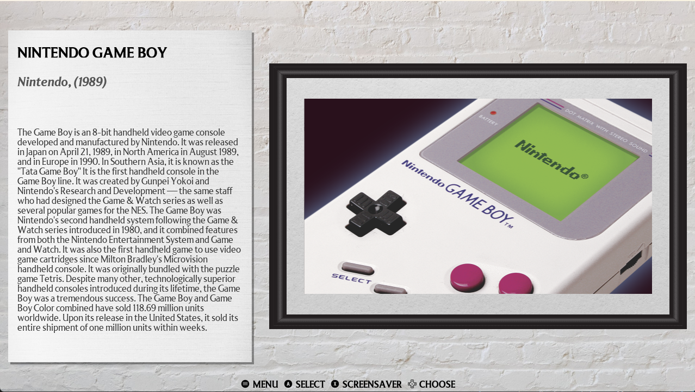
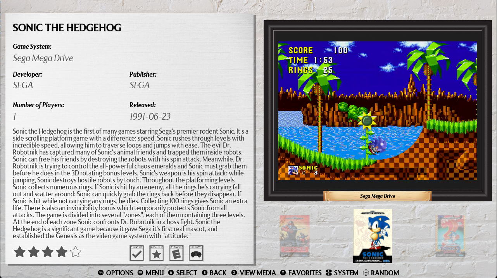

# Museum for EmulationStation Desktop Edition

Museum is a theme set to mimic a museum or art gallery view type for ES-DE that supports all systems as well as the latest application features.

The following options are included:

2 variants:

- With videos
- Without videos

4 aspect ratios:

- 16:9
- 4:3
- 16:10
- 21:9

